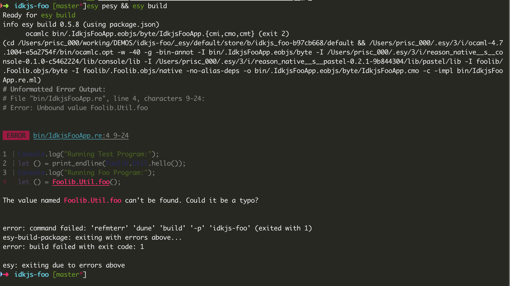

# Creating, Publishing to NPM, and Using Reason Libraries and Tools

## Library in the source form

Easiest way to get started with distributing you library is to publish the source to NPM. Let's take a look at an example.

We will bootstrap with `pesy`. Install with `npm install -g pesy`.

In the original instructions, the project name foo is used. We change `foo` in the examples below to some other project name as `foo` is already in use on npm and you will not be able to run `npm publish` on that name.

For this demonstration, I used `idkjs-foo`.
Consider a base package `foo` that you created and distributed on NPM. And let's assume, `bar` is the package that consumes `foo`.

```sh
$ mkdir idkjs-foo
$ cd idkjs-foo
$ pesy
# edit code
$ esy pesy # if build config has changes
$ esy build
$ npm publish
```

Publishing to npm is just a matter of running `npm publish`. Lets take closer look at the commands.

```sh
$ mkdir idkjs-foo
$ cd idkjs-foo
$ pesy
```

As you'd know by now, these commands, bootstrap, install dependencies and build the entire project.

At this point, our project looks like this

```
│
├── library
│
├── executable
│
├── test
│
└── testExe (test runner)

```

With the `buildDirs` section of the package.json looking like the following

```json
  "buildDirs": {
    "test": {
      "require": [
        "idkjs-foo/library",
        "rely.lib"
      ],
      "flags": [
        "-linkall",
        "-g"
      ]
    },
    "testExe": {
      "require": [
        "idkjs-foo/test"
      ],
      "bin": {
        "RunIdkjsFooTests.exe": "RunIdkjsFooTests.re"
      }
    },
    "library": {},
    "executable": {
      "require": [
        "idkjs-foo/library"
      ],
      "bin": {
        "IdkjsFooApp.exe": "IdkjsFooApp.re"
      }
    }
  },
```

Given that pesy tries to unify packages and libraries, for a config mentioned above it has made `library` available under the namespace `Library`. So anytime `foo` is added as a dependency, a module `Library` becomes available in the codebase.

Since `Library` is to generic to be useful, let's rename it to `FooLib` (i.e. make rename the package as foolib)

```sh
$ mv library foolib
```

And update the config

```diff
  "buildDirs": {
    "test": {
      "require": [
-        "idkjs-foo/library"
+        "idkjs-foo/foolib"
        "rely.lib"
      ],
      "flags": [
        "-linkall",
        "-g"
      ]
    },
    "testExe": {
      "require": [
        "idkjs-foo/test"
      ],
      "bin": {
        "RunFooTests.exe": "RunFooTests.re"
      }
    },
-    "library": {},
+    "foolib": {},
    "executable": {
      "require": [
-        "idkjs-foo/library"
+        "idkjs-foo/foolib"
      ],
      "bin": {
        "IdkjsFooApp.exe": "IdkjsFooApp.re"
      }
    }
  },
```

Since config has changed, we run `esy pesy` and `esy build` to build the project.

```sh
$ esy pesy
$ esy build
```

Let's edit the Utils.re too

```reason
let foo = () => print_endline("Hello from foo");
```

Let call this from `IdkjsFooApp.re`.

```reason
let () = Foolib.Util.foo();
```

Run `esy build` and you should get an error because `Foolib.Util.foo()` is not available in `Utils.rei` which controls which functions from `Utils.re` are exposed from the `Utils.re` module. It's worth noting here how silly stupid awesome the errors you get are when using reason-native. If you are used to using `reason` with `bucklescript` you already know that the compilers error messages take a minute to get used to but are amazing. They just aren't formated so clearly. Here, right in the middle of the noise is the clearly formatted, color coded error with the type signatures that don't match. You can almost copy/paste the signature of your function into the the `.rei`. Here, the error tells us that the `Foolib.Util.foo` function is not available to `IdkjsFooApp.re`. Let's do that.



Expose `foo` in `Utils.rei` by adding the following to it:

```reason
let foo: unit => unit;
```

Build and publish!

```sh
$ esy build
$ npm publish
```

## Consuming `idkjs-foo`

Let quickly create a new project, `bar` and add `idkjs-foo`.

```sh
$ mkdir bar
$ cd bar
$ pesy
$ esy add idkjs-foo
```

We can now require `idkjs-foo` (sort of like we did in Javascript)

```diff
  "buildDirs": {
    "test": {
      "require": [
        "bar/library",
        "rely.lib"
      ],
      "flags": [
        "-linkall",
        "-g"
      ]
    },
    "testExe": {
      "require": [
        "bar/test"
      ],
      "bin": {
        "RunBarTests.exe": "RunBarTests.re"
      }
    },
    "library": {
      "require": [
+        "idkjs-foo/foolib"
      ]
    },
    "executable": {
      "require": [
        "bar/library"
      ],
      "bin": {
        "BarApp.exe": "BarApp.re"
      }
    }
  },
```

And then edit Utils.re

```js
let foo = () => {
  Foolib.Util.foo();
  print_endline("This is from bar");
};
```

And then edit `Utils.rei` to expose the `foo` function like we did above.

```reason
let foo: unit => unit;
```

Call foo from `BarApp.re`:

```reason
Console.log("Running Foo function");
let () = Library.Util.foo();
```

```sh
$ esy pesy
$ esy build
$ esy x BarApp.exe
Running Test Program:
Hello, World!
Running Foo function
Hello from foo
This is from bar
```

Publishing and consuming Reason native packages from NPM is easy. We just need to keep in mind that the namespace exposed from our library depends on the name of the folder!

Thanks to [@jordwalke](https://mobile.twitter.com/jordwalke) who's [readem.md](https://github.com/esy/pesy/blob/master/README.md) this is basically a direct copy of except where its updated and with a few additional comments.

Thanks to [@_anmonteiro](https://mobile.twitter.com/_anmonteiro), [Et7f3](https://github.com/Et7f3), [GriefSeeds](https://discordapp.com/channels/235176658175262720/235200837608144898/624302640171319321), [lessp](https://discordapp.com/channels/235176658175262720/235200837608144898/624303076446175243), [@ulrikstrid](https://mobile.twitter.com/UlrikStrid),[@cem2ran](https://mobile.twitter.com/cem2ran) and [@jordwalke](https://mobile.twitter.com/jordwalke) for the impromptu master class they held in the `reasonml` [`#native-development](https://discord.gg/sFMSycu) channel for no damned reason at all except maybe to share the knowledge. I hope this post is proper reciprocation of their generosity. The master class is a good read. Its starts here on the [#native-development](https://discordapp.com/channels/235176658175262720/235200837608144898/624245210574225409) channel.
